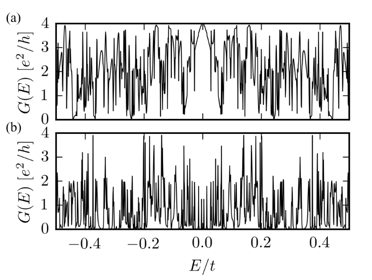
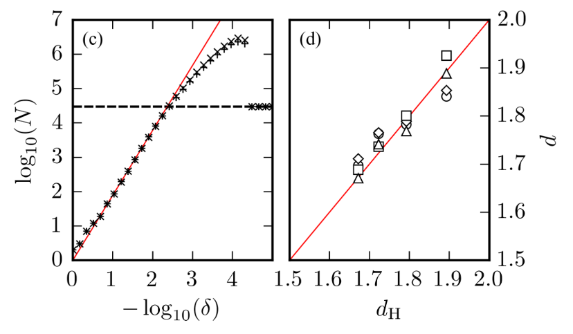

# Dimensão fractal no carpete de sierpinski

---
## Caracterização do sistema

Cada carpete de sierpinski é caracterizado por:

* Número $m$ de interação;
* Estrutura da rede (quadrada, triangular, hexagonal);
* Número $n$ de átomos ao longo da borda inferior.

Localização dos _leads_.

* _Leads_ centralizados, um em cada lado;
* _Leads_ na diagonal, um localizado na parte inferior do lado esquerdo e o outro localizado na parte superior do lado direito.

---

## Gráfico de condutância em função da energia

* Rede quadrada;
* Interação $m = 3$;
* $n = 54$;
* (a) _Leads_ centralizados;
* (b) _Leads_ na diagonal.

___

## Análise do _Box - Counting_

* Rede quadrada;
* Interação $m = 4$;
* $n = 162$;
* (a) _Leads_ centralizados;
* (b) _Leads_ na diagonal.

